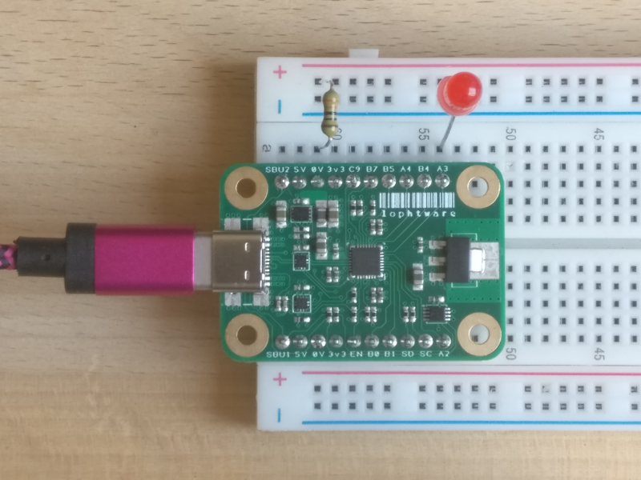

# Hello, World !
This page illustrates the obligatory _Hello, World !_ example of a blinking LED.  There are a lot of words to explain the key concepts of the device but the
code itself is simple.  Python is the language of choice but the process is the same no matter what language is chosen.  The source code for the
[blinking LED example](../blob/master/src/examples/blink/python/blink.py) is in the GitHub repository.  Various other [examples](../tree/master/src/examples/)
are also in the repository.  Most of the examples are bare-bones intended to show the usage of one or two of the [reports](UsbDeviceModel/Interfaces.md), with
minimal error checking and other fluff.  So when implementing your own code, be aware of the things that have been ommitted at the expense of robustness.

## The Breadboard Layout
The breadboard layout is simple.  A resistor, in this case 330 ohms but any that limits the current to less than 10mA will do, and an LED connected in series
from pin *A3* to ground, the anode connected to *A3*:
[](HelloWorld-Breadboard-4640x3480.png)

## HID
The chosen protocol for communicating with the device is the _Human Interface Device_ (_HID_) protocol.  There are limitations to using (abusing ?) this protocol
but the benefits of simplicity and being able to utilise native driver support allow the device to just work out of the box to provide an easy prototyping
experience, and those are the overriding concerns for the default firmware implementation.

On the mainstream operating systems no drivers need to be installed to talk to USB HID devices but leveraging that functionality is OS-specific.  Feel free to
write for the native drivers if it suits your application, but there are some libraries such as [HIDAPI](https://github.com/signal11/hidapi/) that provide a
consistent and portable interface across systems.  For this walkthrough we will be installing one of those libraries to keep things simple and portable.  The
chosen library is HIDAPI and some Python bindings are provided by the [cython-hidapi](https://github.com/trezor/cython-hidapi/) package.

### Installing cython-hidapi
On GNU/Linux systems, Python, libusb and udev development packages need to be installed.  This depends on your distribution, but under Debian it would be
something like:
```bash
$ sudo apt-get install python-dev libusb-1.0-0-dev libudev-dev
```
For the Python packages, you can grab those from pip.  Again, something like the following ought to work:
```bash
$ sudo pip3 install --upgrade setuptools
$ sudo pip3 install hidapi
```
This isn't a howto for installing a HID library, so we'll move onto the next section.  If you've not already got a working Python installation and you want to
try running the examples then you'll want to do a bit of t'interweb searching.  An _exercise for the reader_, as it were.

### Preamble
Using the HIDAPI bindings in Python is as easy as:
```python
import hid
```
We'll also make use of a few constants.  The _Vendor ID_ (_VID_) is a globally unique ID for the manufacturer of a USB device.  You typically have to pay
thousands to the USB Implementor Forum for these, but the sensible people at [pid.codes](http://pid.codes/) have decided to allow the community to use some of
their IDs.  Each product manufactured by a vendor also gets a unique ID, the _Product Identifier_ (_PID_).  For this project the values are:
```python
VID = 0x1209
PID = 0x0001
```
As well as those two values, which are used in locating attached devices, we will need an _Interface ID_ for communicating with a specific part of the device.
The Interface ID is a number assigned by the firmware based on a functional model.  The better way to locate the interface is by name, but for the examples it's
easier to use the ID.  Pin assignment, manipulation and configuration is done via the [Core Interface](UsbDeviceModel/Core/Interface.md) whose ID is:
```python
CORE_INTERFACE = 0x00
```
There are [other interfaces](UsbDeviceModel/Interfaces.md) available for utilising other parts of the device.

## Blinky, Blinky...
Blinking the LED is as simple as finding a handle to the device, using it to configure the pin and then toggling that pin in a loop.  The
`get_path_to_device_interface()`, `configure_a3_as_led_output()` and `toggle_pin()` functions will be defined and discussed below.
```python
if __name__ == "__main__":
	core_interface_path = get_path_to_device_interface(CORE_INTERFACE)
	if not core_interface_path:
		print("Device is not connected.")
		exit(1)

	dev = hid.device()
	dev.open_path(core_interface_path)
	try:
		print("Manufacturer :", dev.get_manufacturer_string())
		print("Product      :", dev.get_product_string())
		print("Serial Number:", dev.get_serial_number_string())

		led = configure_a3_as_led_output(dev)
		while True:
			time.sleep(1)
			toggle_pin(dev, led)

	finally:
		dev.close()
```

## Finding the Device
The HIDAPI library provides a `hid.enumerate()` function to find _paths_ for all connected devices; under Linux these are filesystem paths, usually somewhere
in `/dev` or `/sys`, but the following also works under Windows.  Assuming that there is only one connected device with the _VID_, _PID_ and _Interface ID_ that
we're looking for, the code is as simple as:
```python
def get_path_to_device_interface(intf):
	for ls in hid.enumerate():
		if ls["vendor_id"] == VID and ls["product_id"] == PID and ls["interface_number"] == intf:
			return ls["path"]

	return ""
```

## Configuring the Device
The first step in using the device is to configure it.  The default state of the device is intended to be as benign as possible so all of the pins will be
tri-stated (inputs) when power is applied.  It is possible to configure the device and then
[store that configuration in flash](UsbDeviceModel/Core/Reports/0x08.md) so that the default state of the device when power is applied is how you last configured
it.  This is obviously great for specific and long-running projects but for simplicity most of the examples assume a default factory-reset firmware and do not
store any configuration, unless of course that is what they are demonstrating.  Thus, power-cycling the device, strobing its `/MCLR` pin or issuing a standard
USB `Set_Configuration` command will revert any configuration changes made by the examples.

Based on the breadboard layout illustrated above, we will be using the `A3` pin as an output connected to the LED.  Configuring a pin is accomplished by sending
a [Pin Configuration (A3)](UsbDeviceModel/Core/Reports/0x43.md) command (HID report) to the [Core Interface](UsbDeviceModel/Core/Interface) of the device.  The
individual fields that make up the report are named explicitly in the example for clarity and are detailed on the
[Pin Configuration (A3)](UsbDeviceModel/Core/Reports/0x43.md) page.  Most of the fields are not relevant to blinking an LED but the gist is that pin `A3`
will be assigned our own ID of `0x00`.  The pin will be configured as a push-pull output so that it can both source and sink current:
```python
def configure_a3_as_led_output(dev):
	report_id = 0x43
	unlock_key = [0x00] * 8
	suspend_behaviour = 0x00
	core_interface_id = 0x00
	output_function_id = 0x01
	pin_behaviour = 0x00
	interrupt_behaviour = 0x00
	led_pin_id = 0x00
	reserved = [0x00] * 4

	send_report(
		dev,
		[report_id] + unlock_key + [suspend_behaviour, core_interface_id,
		output_function_id, pin_behaviour, interrupt_behaviour, led_pin_id] +
		reserved)

	return led_pin_id
```

## Sending Reports
Sending HID reports with HIDAPI is simple and looks like regular file I/O, albeit with a small difference.  The interface's device handle, `dev` in our case, can
be read and written with `read()` and `write()` calls.  When reading, we get at most _one_ report back, up to the number of bytes we request.  This simplifies
parsing the reports.  For this example we're not expecting any response over 16 bytes.

All of the commands sent to the device will have some sort of response, even if that is a generic [Command Acknowledgement](UsbDeviceModel/Reports/0x01.md)
report.  Be aware that the first report that is sent back is not necessarily the response we're looking for as the device might be processing other commands in
parallel, or processing a long-running command, or simply just notifying the Host of a status change.  For the example below we don't need to concern ourselves
with these sorts of details so we just ignore unexpected reports until we find the expected one.

The first byte of any report is its ID, with `0x01` being reserved across all interfaces as the [Command Acknowledgement](UsbDeviceModel/Reports/0x01.md).  Each
interface might augment that generic report with its own information if necessary.  For example, the specific acknowledgement we're looking for after configuring
the pin is the [Core Interface's Command Acknowledgement](UsbDeviceModel/Core/Reports/0x01.md).  If we get a response for another report -
`ack[1] != our report ID` - then we ignore it.  If we get a _Negative_ Acknowledgement (NACK, indicated by a non-zero status code `ack[2] != 0`) then
something went wrong, so we throw an exception.  There really is no attempt to do anything useful with the responses in this example.
```python
def send_report(dev, report, expected_ack=0x01):
	dev.write(report)
	while True:
		ack = dev.read(16)
		if ack[0] == 0x01 and ack[1] == report[0]:
			if ack[2] != 0:
				raise Exception("Got NACK for report ID 0x{:02x}, with status 0x{:02x}".format(ack[1], ack[2]))
			else:
				return ack
		elif ack[0] == expected_ack:
			return ack
```

## Flashing the LED
Flashing the LED is done by toggling pin `A3` - or rather, the pin we assigned the ID of `0x00` - in a loop.  Toggling a pin that has been assigned to the
[GPIO function](UsbDeviceModel/Core/Reports/0x43.md#gpio) of the [Core Interface](UsbDeviceModel/Core/Interface.md) is done with the
[Pin Parallel Load / Set / Reset / Toggle](UsbDeviceModel/Core/Reports/0x14.md) command.  This command takes an operator - _load_, _set_, _reset_ or _toggle_ -
and a 16-bit word, with each bit in the mask representing one of the pins.  Our assigned ID of `0x00` reads as 'bit 0', so our mask is `1 << 0`.  It is possible
to manipulate more than one pin at a time which is useful for writing values onto a bus or controlling a 7-segment display, for example.  See
[blink2.py](../blob/master/src/examples/blink/python/blink2.py) for an example that flashes two LEDs to output a 2-bit counted sequence.

As an acknowledgement to modifying the pin values, the [Pin Parallel Load / Set / Reset / Toggle](UsbDeviceModel/Core/Reports/0x14.md) command will respond with
a [Pin Parallel Status](UsbDeviceModel/Core/Reports/0x16.md) report.  For this example we don't really care what the contents of that report are so it is just
read and discarded, but the report represents the state of each of the GPIO pins after the operation.
```python
def toggle_pin(dev, pin_id):
	report_id = 0x14
	toggle = 0x02
	mask = 1 << pin_id
	send_report(dev, [report_id, toggle, mask & 0xff, (mask >> 8) & 0xff], expected_ack=0x16)
```
Watch an [action shot](HelloWorld-Breadboard.mp4) of the breadboard running [blink.py](../blob/master/src/examples/blink/python/blink.py).

## Job Done
So in summary, the order of operations for prototyping with the device can be generalised as:
1. Find the device and get a handle to the interface(s) of interest
2. Configure the pins and other device functions, if they have not been previously configured for your purpose
3. Optionally store the configuration into flash so that it persists across power cycles; we recommend [giving your configuration a name](UsbDeviceModel/Usb/Reports/0x04.md) in this case
4. Send reports to and monitor the reports from the device to do useful work and prototype awesome stuff

Whilst a blinking LED is a satisfying first foray into a new device, it's not exactly going to take the world by storm.  So check out the other parts of the
[USB API](UsbDeviceModel/Interfaces.md) documentation and take a peek at the [I<sup>2</sup>C functionality](I2c/Index.md) to get a flavour of how you can
control your next breadboard or prototype.

If the default firmware's not good enough for you, not fast enough, not flexible enough, or you just need some bugfixes or features, then you probably ought to
be looking to [flash it](Icsp.md) and [hack it](Schematics.pdf).

Have fun...
