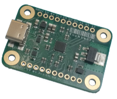

# USB Type-C / PIC32 Breakout Board
The USB Type-C / PIC32 Breakout Board is a breadboarding and prototyping aid with firmware providing common functionality for a variety of general-purpose
use-cases.  The board aims to be a more flexible offering compared to the FT232-type breakout boards by incorporating a 32-bit PIC.  The major design goal is
plug-n-play for rapid prototyping without the need for an in-depth knowledge of USB or having to install custom drivers.

The chosen USB protocol for the stock firmware is _HID_ (Human Interface Device) because it is ubiquitous and does not require drivers or (significant)
configuration of the Host to be up and running fast.  It _should just work_.

## Highlights and features
  - A 32-bit [PIC32MM0256GPM028](https://github.com/lophtware/UsbCPic32Breakout/blob/master/doc/datasheets/mcu/PIC32MM0256GPM028.pdf) MIPS microcontroller running at 24MHz and featuring:
    - 256KiB of Flash for program memory and configuration
    - 32KiB of RAM
    - 11 General Purpose Inputs / Outputs (GPIO) broken out to 0.1" headers for bit-banging, status flags or microcontroller peripherals
    - An I2C bus controller capable of operating as both Master and Slave
    - An SPI / I2S controller (Master only for the default firmware)
    - A Universal Asynchronous Receiver / Transmitter (UART) controller
    - A 12-bit Analogue-to-Digital Converter (ADC)
    - Analogue comparators
    - Pulse Width Modulation (PWM) controllers
    - Capture / Compare / PWM modules
    - Timers
    - Four Configurable Logic Cells (CLCs)
  - USB 2.0 Full Speed (12Mib/s) Compatible Human Interface Device (HID) Endpoints, negating the need for custom drivers
  - USB Type-C power / CC pin capability detection - note this is _NOT_ USB PD ([FUSB303](https://github.com/lophtware/UsbCPic32Breakout/blob/master/doc/datasheets/usb/FUSB303.pdf))
  - Programmable both via USB Type-C Debug Accessory Mode to allow firmware updates without opening an enclosure, or via GPIO pins ([ICSP](Icsp.md))
  - A +3.3V Low Drop-Out (LDO) Linear Regulator ([AP2114HA](https://github.com/lophtware/UsbCPic32Breakout/blob/master/doc/datasheets/power/AP2114HA-1.2TRG1.pdf)) capable of supplying a typical 1A (derated to 150mA at 50 Celsius ambient, without a heatsink)
  - Over-current protection of 1.5A (typical; 1.2A-1.8A) to protect the Host from breadboard disasters ([NCP367DPMUEC](https://github.com/lophtware/UsbCPic32Breakout/blob/master/doc/datasheets/usb/NCP367DPMUEC.pdf))
  - Over-voltage protection up to +24V to protect the device and any breadboard circuitry ([NCP367DPMUEC](https://github.com/lophtware/UsbCPic32Breakout/blob/master/doc/datasheets/usb/NCP367DPMUEC.pdf))
  - All GPIO pins capable of sourcing / sinking 10mA, enough to drive LEDs (remember a series resistor !)
  - Small board with mounting holes, occupying less than the 12-hole width of a standard breadboard strip
  - Firmware source, board schematics and examples

## See Also
[Hello, World !](HelloWorld.md) for the obligatory blinking LED.

The [USB Device Model](UsbDeviceModel/Interfaces.md) page for a description of the device's USB structure and communications protocol.

The [I2C](I2c/Index.md) page for information on interacting with the device via an I2C bus.

For applying firmware updates and uploading custom firmware there are two methods of [In-Circuit Serial Programming](Icsp.md).

And as with everything else in life, there are a few ['quirks'](Quirks.md)...

	 This documentation is licensed under a <a rel="license" href="https://creativecommons.org/licenses/by-sa/4.0/">Creative Commons Attribution-ShareAlike 4.0 International Licence</a>.

